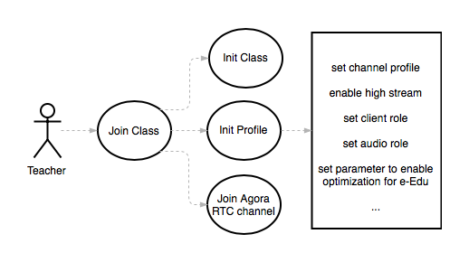
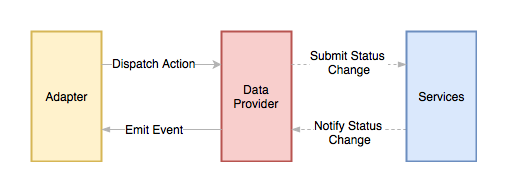

## Adapter
> Adapter encapsulation original Agora APIs in e-Edu situation

For example, before joining class, you should set related profile to make your client work properly and have the optimization for e-Edu situation.

``` javascript
  /**
   * Encapsulation regular profile you need to set
   * @param {boolean} audience if user is an audience
   * @param {number} videoProfile videoProfile 
   * @param {boolean} swapWidthAndHeight if swap width and height
   */
  initProfile(audience = false, videoProfile = 43, swapWidthAndHeight = false) {
    let rtcEngine = this.rtcEngine
    rtcEngine.setChannelProfile(1)
    rtcEngine.setClientRole((audience ? 2 : 1));
    rtcEngine.setAudioProfile(0, 1);
    rtcEngine.enableWebSdkInteroperability(true)
    rtcEngine.setParameters('{"che.audio.live_for_comm":true}');
    rtcEngine.setParameters('{"che.audio.enable.agc":false}');
    rtcEngine.setParameters('{"che.video.moreFecSchemeEnable":true}');
    rtcEngine.setParameters('{"che.video.lowBitRateStreamParameter":{"width":192,"height":108,"frameRate":15,"bitRate":100}}');
    if(!audience) {
      // audience do not publish stream
      rtcEngine.enableDualStreamMode(true);
      rtcEngine.enableVideo();
      rtcEngine.enableLocalVideo(true);
      rtcEngine.setVideoProfile(videoProfile, swapWidthAndHeight);
    }
  }
```

Without adapter, you must set all of these yourself, even if you only want to implement a client with 3 type of role in a common e-Edu situation: 
- Teacher: High-quality video, presenter.
- Student: No need for high-quality, presenter too.
- Audience: Only subscribe stream, never publishing

For example, when a teacher joining class:



With Adapter:

``` javascript
    AdapterClient.initClass(APP_ID, channel, {uid, username, role}).then(() => {
      AdapterClient.initProfile()
      // some logic, for example you can just do join now
      // AdapterClient.enterClass
    }).catch(err => {

    })
```

## Data Provider



Data provider is for receiving action from client and dispatching it to server, 
either receiving status change from server and emit client event.

For example, when adapter trying to do `initClass`, you must connect to your 
server and update your info in a session maybe. Implemention varies depending on 
your practical business logic. That is why we provide a `base interface: Data Provider`

``` javascript
// you should implement your data provider with your tech stack
dispatchInitClass() {

  // maybe socket.io
  // io.emit(...)
  
  // maybe an ajax
  // axios.post(...)

  // or your own signaling tunnel
  // yourSignaling.dosth
}
// dispatchBroadcastMessage()
// dispatchStartScreenShare()
// ...
```

Whenever you want to integrate this e-Edu with your existed services, just implement a data provider 
according to the services. Everything becomes scalable and clear.

*And we have already implement an example data provider and related services, so you use it directly.*