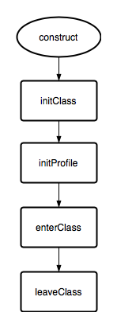

## API Adapter



### constructor

``` javascript
// init adapter
import AdapterClient from 'path/to/adapter'
// ...
constructor() {
	super()
	this.client = new AdapterClient()
}

```

In React, you can either pass them to each components by `Props` or `Context API`.


### initClass and initProfile

``` javascript
// init class
this.client.initClass(agoraAppId, channel, user = {uid, username, role}).then(() => {
	this.client.initProfile(audience, profile, swap)
	// do redirection
}).catch(err => {
	// handle error
})

```

`initClass` will dispatch action 'initClass' and related payload(appid, channel, userinfo...) to `Data Provider`. Then `DataProvider` should connect to
server and update user info (maybe by socket.io or ajax, it all depends on you).

`initProfile` do most of common settings and optimization for e-Edu. It provides three params: audience (boolean) to determine wheter to publish stream, profile for resolution, and swap (boolean) to determine whether to rotate the video. (You can also modify this method according to your situation.)

### device test

Agora RTC Engine provides kinds of APIs for device test. So we recommend you to use object `client.rtcEngine` directly and go to sdk apis for detail.

### enterClass and prepareScreenShare

``` javascript
this.client.enterClass()
if(this.client.user.role === 'teacher') {
  this.$client.prepareScreenShare()
}
```

At last you should use enterClass to make the media stream join the class. And, if ther user is a teacher, maybe you need to use prepareScreenShare to make the sharing stream join the class. So you can use startScreenShare and stopScreenShare to start/stop capture your screen.

Apart from these, you should add some listeners for client events, here are the events we register in temp:

- this.client.on('teacher-added', (uid, info, streamId) => {})
- this.client.on('student-added', (uid, info, streamId) => {})
- this.client.on('audience-added', (uid, info, streamId) => {})
- this.client.on('teacher-removed', (uid) => {})
- this.client.on('student-removed', (uid) => {})
- this.client.on('audience-removed', (uid) => {})
- this.client.on('screen-share-started', ({shareId, sharerId}) => {})
- this.client.on('screen-share-started', () => {})
- this.client.on('message-received', ({id, detail = {message, ts, uid, username, role, type}}) => {})
	
### startScreenShare and stopScreenShare
Once prepareScreenShare resolved, you can use these two apis to start/stop screen capture and notify others in class.

### muteVideo/unmuteVideo/muteAudio/unmuteAudio
These apis can accept `number` or `number[]` or even `undefined` as param.

- undefined: target is yourself
- number: target user's uid
- number[]: a group of target

### broadcastMessage

This is for common chatting in class or you can broadcast instructions to use 'json' type.

### destructScreenShare and leaveClass

Relative to enterClass and prepareScreenShare.

### Some private methods

- getUser(uid: number): User    
give a uid and get a User object (username, role, uid ...)


## Data Provider
You can either implement your own data provider according to your tech stack (Go to BaseDataProvider for detail) or use our example data provider (**Not recommended for production environment**).